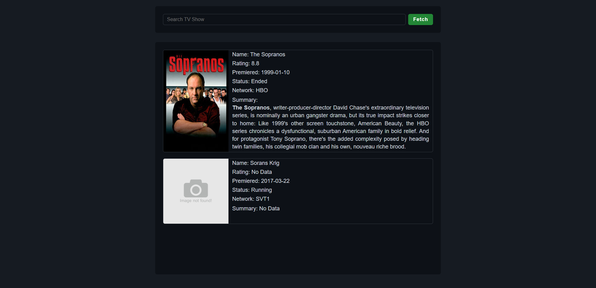

# TV Maze API - Search About Your Favorite Shows 
This is a TV Show Search Engine that allows users to search for information about TV shows. 
It utilizes the TV Maze API to fetch data about a TV show and display it's information.
Built using HTML,css and js
## Overview

## Demo
> This gif shows a brief overview of the project, and it may take a while to load!

## Features
- Search for TV shows by title
- Display detailed information about a TV show, including its name, summary, rating, status, premiered, network and image
- Responsive design that adapts to different screen sizes, ensuring a seamless user experience across devices

## Getting Started
To clone and run this project locally, follow these steps:
- Clone the Repository: git clone https://github.com/mohammedamcs/tv-search-engine.git
- Navigate to the project directory: cd tv-search-engine
- Open the index.html file in your preferred web browser.
